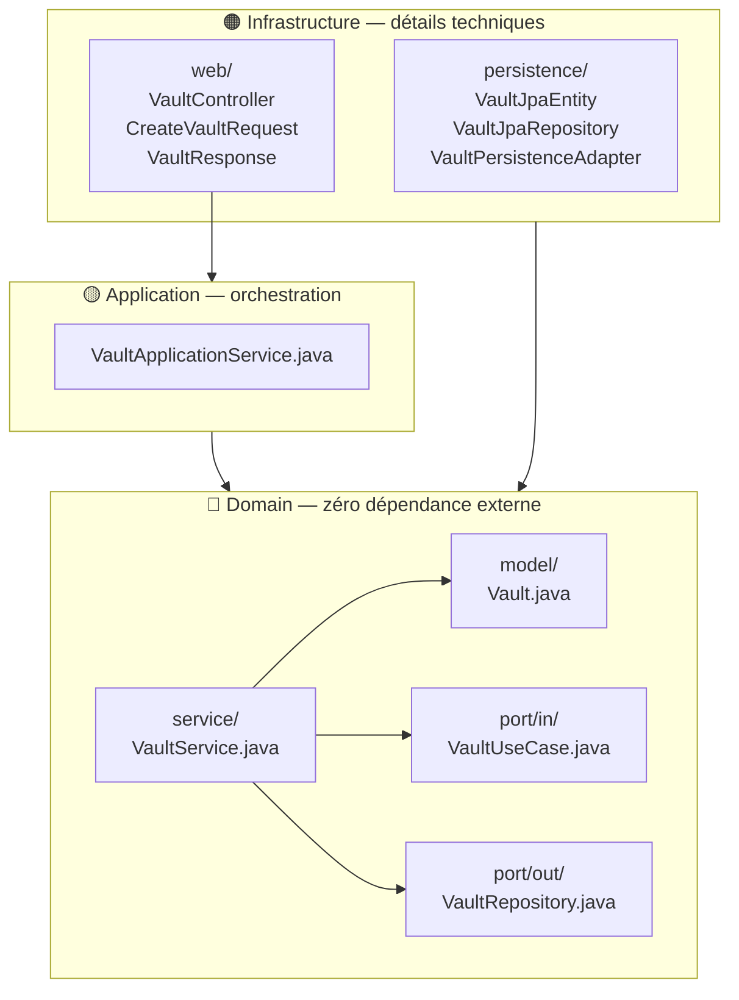

# ADR-001 : Architecture Hexagonale

## Statut
Accepté — Implémenté le 22/06/2026

## Contexte
SecureVault est une application de gestion de secrets et credentials
avec un fort enjeu sécurité. Le domaine métier (gestion de coffres,
chiffrement, permissions) doit être isolé des détails techniques
(base de données, framework web, providers cloud) pour :
- Faciliter les tests unitaires du domaine sans infrastructure
- Permettre de changer un détail technique sans impacter le métier
- Rendre les règles de sécurité explicites et centralisées

## Décision
Nous adoptons l'architecture hexagonale (Ports & Adapters) pour le backend.

Le domaine ne dépend d'aucun framework. Spring, JPA, et les autres
détails techniques dépendent du domaine, jamais l'inverse.

Structure retenue :
- `domain/` : entités, value objects, ports, services métier
- `application/` : orchestration des use cases
- `infrastructure/` : adaptateurs (JPA, REST, crypto, Azure)

## Conséquences
✅ Le domaine est testable sans Spring ni base de données  
✅ Les règles métier sont lisibles sans connaître le framework  
✅ On peut remplacer PostgreSQL ou Spring sans toucher au domaine  
⚠️ Plus de fichiers et de couches qu'une architecture en couches classique  
⚠️ Courbe d'apprentissage initiale plus élevée

## Structure détaillée

**Règle absolue** : les flèches vont toujours vers le Domain, jamais dans l'autre sens.